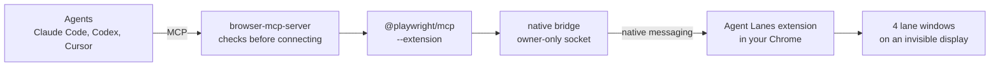

<h1 align="center">Agent Lanes for Chrome</h1>

<p align="center">
  <strong>Let many AI agents use your real, logged-in Chrome at the same time, in the background, without ever taking your screen.</strong>
</p>

<p align="center">
  <a href="https://github.com/ZipLyne-Agency/agent-lanes/actions/workflows/ci.yml"></a>
  <a href="https://github.com/ZipLyne-Agency/agent-lanes/releases"></a>
  <a href="LICENSE"></a>
  
  
  
</p>

---

Your agents need the browser you are already logged in to: your Google Workspace, your
dashboards, the sites where 2FA is already done. The usual ways to give it to them each
break something. The agent drives the tab you are reading, Chrome jumps to the front
mid-sentence, a permission dialog pops up for every connection, or you end up with a
copied profile that is logged out anyway.

Agent Lanes for Chrome gives every agent its own private tabs inside **your own Chrome
profile**, on windows that live on an **invisible display**. You keep working. Chrome never
comes to the front, your tabs never change, and your links keep opening where you expect.

## What you get

- **Your real profile.** Your cookies, SSO, passkeys, and extensions. No copied profile,
  no exported cookies, no second browser.
- **Up to 64 agents at once,** in four lanes of 16. Each session owns its tabs exactly; no
  agent can touch another's, or yours.
- **Nothing on your screen.** Lanes sit on a virtual display nobody can see. Chrome is
  never activated, your selected tab never changes, your macOS Space never switches.
- **Real input that keeps working.** Clicks and typing are trusted browser input, measured
  at 61 frames per second while another app is in front.
- **Your links stay yours.** A link from Mail or Slack opens in your window, never in an
  agent's.
- **No debris.** `browser_close` removes exactly that agent's tabs. No tab groups, ever.
- **No token in your configs.** Agents reach the extension through a native messaging host
  and an owner-only socket; the pairing token never enters an MCP config.
- **Self-healing.** The pool refills itself in the background, survives extension reloads
  and Chrome restarts, and a tripwire turns background refill off the moment it ever pulls
  Chrome forward.

## How it works



1. Each agent session is a **background tab inside a lane**, one of four ordinary Chrome
   windows that are never focused. New agents never create windows.
2. Chrome only renders the active tab of a window, so each lane runs a **stage**: it shows
   one session's tab at a time, only while that session has a command running.
3. A small launchd helper keeps a **virtual display** attached, parked off the corner of
   your screens. The lanes live there. You cannot see them, so you cannot close them.
4. The MCP launcher **refuses to connect** unless Chrome runs with
   `--disable-backgrounding-occluded-windows`, the native host is registered to this
   extension only, and the installed extension matches its recorded hashes.

The full design is in [docs/architecture.md](docs/architecture.md).

## Why not just use Chrome DevTools MCP?

Because it was built for debugging, and it is great at that. For background agents:

| | Your logins | Many agents | Stays off your screen |
|---|---|---|---|
| **Agent Lanes for Chrome** | ✅ | ✅ 64 | ✅ |
| Chrome DevTools MCP `--autoConnect` | ✅ | ⚠️ a dialog per connection | ❌ drives your tabs |
| `--remote-debugging-port` on your profile | ❌ ignored since Chrome 136 | ✅ | ✅ |
| Stock Playwright extension | ✅ | ⚠️ as tab groups in your windows | ❌ activates your tabs |
| Headless / Chrome for Testing | ❌ | ✅ | ✅ |
| Computer-use agents | ✅ | ❌ | ❌ takes your mouse |

[docs/why.md](docs/why.md) explains each row, and every platform wall we hit on the way:
minimized windows that stop rendering, popup windows that hold one tab, normal windows that
steal your links, fullscreen windows that never lose focus, and more.

## Install

Requires macOS, Google Chrome, Node.js 20+, and the Xcode Command Line Tools.

```bash
git clone https://github.com/ZipLyne-Agency/agent-lanes.git
cd agent-lanes
scripts/install.sh            # add --dock to put the launcher in your Dock
```

Then, in Chrome (these steps are yours; Chrome treats them as human-only):

1. Remove the Web Store "Playwright MCP Bridge" extension if you have it.
2. Quit Chrome with Command-Q and reopen it with **`~/Applications/Google Chrome (Agent Safe).app`**.
3. In `chrome://extensions`, turn on Developer mode, **Load unpacked**, and choose
   `~/.local/share/agent-lanes/extension`.
4. Click into Chrome for a few seconds, then check the pool:
   `~/.local/bin/playwright-mcp-native-bridge --status`

Prefer a download? Every [release](https://github.com/ZipLyne-Agency/agent-lanes/releases)
attaches the built extension as a zip. The extension alone is not enough, though: the
bridge, launcher, and display helper come from the installer.

Full instructions, options, and a FAQ: [docs/install.md](docs/install.md).

## Connect your agents

```bash
claude mcp add --scope user browser -- "$HOME/.local/bin/browser-mcp-server" playwright
```

```toml
# ~/.codex/config.toml
[mcp_servers.browser]
command = "/Users/you/.local/bin/browser-mcp-server"
args = ["playwright"]
```

Cursor and other clients: [examples/](examples). Then give your agents
[**AGENTS.md**](AGENTS.md): the rules they need on this route (work only in your own tabs,
never bring Chrome forward, always `browser_close`, credentials are human-only). There is
also a ready-made skill in [skills/browser-mcp](skills/browser-mcp).

## Status

This is the setup we run every day, published as it stands. We say exactly what has been
proven and what has not.

| Proven live | When |
|---|---|
| 24 simultaneous agents across four lanes, trusted input, exact cleanup, no focus or Space change | 2026-09-04 |
| Lanes on the invisible display: 61 fps, trusted typing, clicks, and screenshots with another app in front | 2026-09-28 |
| Background refill: 12 lane windows created and 15 closed without Chrome coming forward | 2026-09-28 |
| Focus that lands on a hidden lane is handed back in under half a second; the agent keeps working | 2026-09-28 |
| An extension reload keeps the pool (the reloaded lanes are re-anchored) | 2026-09-28 |
| After a Chrome crash and relaunch, lanes were re-adopted by their markers; one holding a leftover session tab was kept aside for the user, as designed | 2026-09-28 |

Not yet run live: clicking Chrome's Dock icon while only lanes are open, sleep and wake
with the virtual display, and "Displays have separate Spaces" turned on. Known hazards are
listed in [docs/operations.md](docs/operations.md#known-issues).

## Docs

| | |
|---|---|
| [Why](docs/why.md) | The problem, the alternatives, and every wall we hit |
| [Architecture](docs/architecture.md) | Lanes, the stage, the guard, the display, refill, recovery, invariants |
| [Install](docs/install.md) | Setup, options, client configs, update, uninstall, FAQ |
| [Operations](docs/operations.md) | Health checks, refill, recovery, error dictionary, tests |
| [Security](docs/security.md) | What an agent can do, the boundaries, what they are not |
| [Decisions](docs/decisions) | Design records with dates and evidence |
| [AGENTS.md](AGENTS.md) | Rules for the agents using this route |

## Repository

```text
extension/        the Chrome extension (fork of Microsoft's Playwright extension)
bin/              MCP launcher, native bridge, Chrome checks, installers
launcher/         the "Google Chrome (Agent Safe)" app
agent-display/    the invisible display helper and its launchd agent
native-messaging/ the native messaging host manifest
mcp-runtime/      pinned MCP servers and the lane popup script
skills/           an agent skill for this route
examples/         MCP client configs
scripts/          install and uninstall
tests/            unit suites (no Chrome needed) and live acceptance scripts
docs/             everything else
```

## Credits

The extension is a fork of the browser extension in
[microsoft/playwright](https://github.com/microsoft/playwright) (Apache-2.0), and the route
runs Microsoft's [`@playwright/mcp`](https://github.com/microsoft/playwright-mcp). The
fork keeps Microsoft's manifest key so `@playwright/mcp` can find it; see [NOTICE](NOTICE).
Not affiliated with or endorsed by Google or Microsoft. Chrome is a trademark of Google LLC.

Built by [ZipLyne](https://ziplyne.agency). Licensed under [Apache-2.0](LICENSE).
