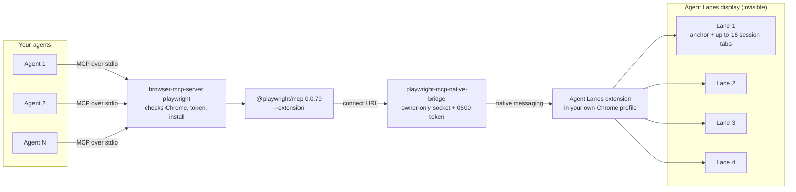

# Architecture

## The chain

| Piece | Where | Job |
|---|---|---|
| `browser-mcp-server` | `bin/` | The MCP entry point. Before it starts Playwright it verifies Chrome has the occlusion switch, the native host is registered to this bridge and this extension only, the token file is owner-only, and Chrome loaded the extension unpacked from the installed path with every file hash matching. Any failure is a specific error, never a fallback to a logged-out browser. |
| `@playwright/mcp` 0.0.79 | `mcp-runtime/` | Microsoft's MCP server in `--extension` mode, pinned and installed once, not fetched with `npx` per agent. It runs with `--executable-path` pointing at the bridge and an init script that keeps page-opened tabs inside their lane. |
| `playwright-mcp-native-bridge` | `bin/` | Two roles. As the "browser executable" Playwright launches, it forwards the non-secret relay URL to the broker over an owner-only Unix socket. As Chrome's native messaging host, it is the broker: it holds the token, authenticates socket clients, and relays connect, status, and pool-management requests to the extension. |
| The extension | `extension/` | Owns the lanes: creates session tabs, schedules which tab renders, guards the lanes, places them on the hidden display, recovers after restarts. |
| `chrome-background-safe` | `bin/` | Starts Chrome with `--disable-backgrounding-occluded-windows`, and checks that exactly one regular Chrome is running with it. |
| Google Chrome (Agent Safe).app | `launcher/` | The app you open Chrome with. It starts Chrome safely and then stays alive, invisible, refilling the lane pool whenever it runs short. Optionally it swaps Chrome's Dock tile (`--dock`). |
| `agent-lane-display` | `agent-display/` | A launchd helper that keeps a 1440x900 virtual display attached, parked off the bottom-right corner of your screens. |

## Lanes

A lane is one Chrome window: `type: normal`, `state: normal`, never focused. It holds
one anchor tab (an inert extension page that identifies the lane and keeps the window
alive) and up to 16 session tabs. The default pool is four lanes, 64 sessions.

A new agent connection never creates a window. It creates a background tab
(`chrome.tabs.create({windowId, active: false})`) in the least-loaded lane, which is
silent. If every lane is full, the connection waits up to 60 seconds for a slot, then
fails with `Authenticated browser pool is at capacity`.

`browser_close` removes exactly that session's tabs. The lane, its anchor, and every
other session in it stay.

## The stage

Only the active tab of a window renders and takes trusted input, so each lane has a
scheduler:

- A session must hold its lane's stage before any debugger command for one of its tabs
  is forwarded. Taking the stage activates that tab with `chrome.tabs.update({active:
  true})`, which changes the tab strip only (it calls `TabList::ActivateTab` and never
  focuses the window).
- The holder keeps the stage while it has commands in flight and for 300 ms after the
  last one (250 ms when another session is waiting).
- A command in flight is never preempted: a Playwright action waiting on an animation
  frame would stall if its tab went dark.
- A holder that runs a gapless burst for 5 seconds while others wait hands over at its
  next idle moment. A holder with no completed command for 30 seconds has its session
  closed, which ends the command and frees the lane.
- After 3 seconds of idleness the anchor tab is shown again.

Because an action can wait behind other sessions in its lane, the launcher gives
Playwright a 20-second action timeout instead of the default 5.

## The guard

Each lane has a guard that watches for two things that must never quietly happen:

- **A foreign tab arriving.** A tab created in a lane that no session asked for and that
  has no agent-owned opener (an external link, a restored tab) is moved to your
  most recently focused normal window. Focus is handed there only if Chrome focused the
  lane to deliver it.
- **You taking the lane.** On a visible screen, focusing, moving, resizing, minimizing,
  or maximizing a lane makes it yours: every session in it ends, its tabs are kept, and
  its anchor becomes a tombstone so it is never re-adopted. On the hidden display
  nobody can see a lane. macOS focuses one when you switch to the Space (desktop)
  where it lives with Chrome active, or through Chrome's Dock icon, Cmd-\`, or the
  Window menu. The guard asks the native host which Space is showing and hands focus
  to your most recent window **on that Space**; focusing a window on another Space
  would make macOS switch you there. With none known on the current Space, focus
  stays on the idle lane until you click elsewhere, and its sessions keep running.
  If you have no Chrome window at all, the guard opens one on the current Space,
  because Chrome counts the hidden lanes as visible windows and would otherwise show
  you nothing.

## The hidden display

`agent-lane-display` creates a virtual display with CoreGraphics' `CGVirtualDisplay`
(a private class; BetterDisplay and DeskPad use the same one). It needs no permission
prompt. It places the display diagonally off the bottom-right corner of your rightmost
screen, so the two arrangements touch at a single point, and a 20 Hz cursor fence warps
the pointer back if it ever slips through that point.

The extension recognises the display by its size and that corner-only position, since
Chrome reports no display names on macOS. After loading, whenever displays change, and
whenever a window appears, it:

- moves every pooled lane onto the display (bounds only, never focus or state);
- moves every other window off it onto your main screen, including a lane you reclaimed
  and any window Chrome opened beside a lane.

If the helper stops, macOS moves the lanes onto a real screen and everything keeps
working as a visible corner stack. When the display returns, the lanes go back.

macOS reports windows on the virtual display as occluded, so the occlusion switch is
what keeps them rendering.

## Keeping everything else off the display

Two guards in `agent-lane-display`, behind one Accessibility grant:

- **Focus guard.** While an invisible lane holds the keyboard, macOS treats Agent Lanes
  as the main screen, so every app opens new windows and dialogs there. A lane gets
  the keyboard when you switch, with Chrome active, to a desktop holding a lane but
  none of your Chrome windows, or through Cmd-\`. Every 250 ms while Chrome is
  frontmost the helper asks Chrome which window holds its keyboard (the app-level
  Accessibility query window managers make; it does not switch on accessibility for
  web content). Stacking order cannot answer this: lanes sit above your windows in
  the window list even on desktops where they are not shown. After a lane has held
  the keyboard for about a second it raises your full-size Chrome window on the
  current desktop, or activates Finder, whose desktop is on every Space.
- **Window guard.** Every second, any ordinary window (layer 0 to 20) of another app
  whose middle sits on Agent Lanes moves, unfocused, to the screen your pointer is
  on. Chrome's windows are the extension's job, and the AutoFill popup beside a lane's
  login field stays with it. Overlays an app shows on every screen are left alone.

## "Leave site?" prompts

An agent leaves pages with unsaved changes all the time: a navigation, a tab close,
the end of its session. Chrome answers each with "Leave site? Changes you made may not
be saved.", a dialog window that takes Chrome's keyboard. On the hidden display nobody
can see it, so your typing in Chrome goes nowhere and the agent's navigation hangs. The
agent always means to leave, so the extension accepts the prompt itself
(`extension/src/leavePrompt.ts`). While a relay is attached, it answers
`Page.javascriptDialogOpening` of type `beforeunload` on an owned tab with
`Page.handleJavaScriptDialog {accept: true}` and forwards neither the prompt nor its
close, so the agent never sees it. Session cleanup closes tabs after the relay has
detached, so it attaches the debugger to each tab for its close and answers the prompt
there. Alerts, confirms, and text prompts still go to the agent.

## Refill and the fuse

The launcher app runs a loop every second while Chrome is open. When the pool is
short, it runs `playwright-mcp-native-bridge --prepare-pool 4 --background`:

- If Chrome is in front, lanes are created normally and your selected window and tab are
  restored.
- If another app is in front and the display is present, the extension creates the
  lanes directly on the hidden display. The bridge samples the front app every 50 ms
  during the request and for 3 seconds after. If Chrome comes forward during a request
  that made a window, the bridge writes a fuse file and background preparation stays off
  until you delete it.
- Before creating anything, preparation adopts any unpooled window that still holds
  nothing but a live lane marker.

A refusal because Chrome is not in front is retried every second. Any other failure
backs off, from 5 seconds up to about five minutes, so a failing lane can never flash a
window once a second.

## Recovery

Lanes (`playwrightLane:*`) and sessions (`playwrightAgentSession:*`, bound to the
Chrome process lifetime) live in `chrome.storage.local`.

- **Service-worker restart:** dead sessions' tabs are removed; lanes are re-adopted by
  their marker URL when they hold nothing but their anchor.
- **Extension reload:** anchors become new-tab husks. A husk is re-anchored when its
  record comes from the same Chrome process, or when it sits on the hidden display. An
  unproven husk on a visible screen is left alone.
- **Chrome restart:** Chrome's session restore brings the lane windows back; ambiguous
  restored tabs are preserved, never deleted.
- A `chrome.runtime.onStartup` listener wakes the service worker after every Chrome
  restart so the native host reconnects without anyone opening the extension UI.

## Invariants

Break one of these and the cost is in the right-hand column.

| Invariant | Why | Breaks as |
|---|---|---|
| Lanes are `type: normal`, never activated after creation | Links go to the most recently activated normal window | Your links open in an agent's window |
| Lanes are `state: normal`, never minimized | Minimized windows stop animation frames and trusted input | Clicks and typing hang |
| Lanes are never focused; only the stage and the guard activate tabs | `Page.bringToFront` and `Target.activateTarget` are suppressed | Chrome jumps to the front mid-task |
| Chrome runs with `--disable-backgrounding-occluded-windows` | Covered windows, and every window on the hidden display, count as occluded | Agent work stalls |
| Windows are created only by pool preparation | Window creation is the one step that could pull Chrome forward | Focus changes on every connection |
| Background creation happens only on the hidden display, only when asked, and never again once the fuse trips | Proven by source and one clean live run, not by a guarantee from Apple | Chrome comes forward while you work elsewhere |
| A command in flight is never preempted | Backgrounding a tab mid-action stalls it | Random hangs under load |
| No Chrome tab groups | Chrome keeps closed group records | The tab-group menu fills up |
| The token stays in one `0600` file read only by the broker | Anything that can read an MCP config could drive your browser | Token leaks |
